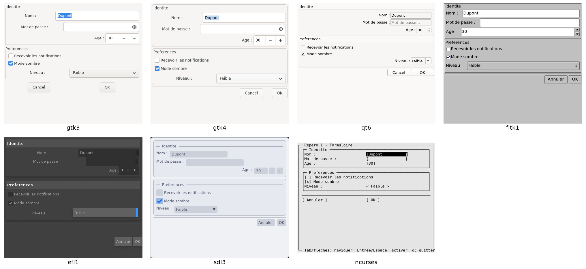

# sermo

**sermo** opens a dialog box described in **XML** from a shell script, then
writes the values the user entered to its output (`NAME="Jane"`). The same
script runs on seven graphical libraries: GTK 3, GTK 4, Qt 6, FLTK, EFL, SDL 3,
and ncurses in a terminal.



*The same script, [`examples/showcase/01-formulaire.sh`](examples/showcase/01-formulaire.sh),
rendered by the binaries of the 2.7.1-1 packages. efl1 keeps its dark theme even
when the light theme is requested ([TODO.md](TODO.md) (French only)). The image is rebuilt by
[`doc/captures/refaire.sh`](doc/captures/refaire.sh).*

[Français](README.md)

## Where sermo comes from

sermo is a fork of **gtkdialog 0.8.3**, written by Pere László and then taken
over by Thunor, under GPL-2.0-or-later. The original line continues here:
<https://github.com/puppylinux-woof-CE/gtkdialog>.

sermo keeps gtkdialog's XML language and parser. It replaces GTK 2 with seven
rendering layers around a shared core, and puts bounds on command execution.
What comes from upstream and what was written here is counted file by file in
[LICENCES.en.md](LICENCES.en.md).

## Project status

- Version **2.7.5**. sermo has **a single maintainer**, S. Cage. There is no team
  behind it: an answer may take time.
- Part of the code, documentation and tests was written with the help of an AI
  (Claude, by Anthropic), directed and reviewed by the maintainer
  ([AUTHORS.en](AUTHORS.en)).
- **What is verified**: 139 benches (XML parsing, exported values, security,
  clicks, opening the real examples) on all seven ports, also replayed on the
  binaries extracted from the Debian packages. Every figure can be replayed with
  a command: [BILAN_SANTE.md](BILAN_SANTE.md) (French only).
- **Known gaps**: the ports without GTK still differ from gtk3sermo on a few
  points (`auto-refresh`, initial selection in lists, `<terminal>`…). They are
  listed in [TODO.md](TODO.md) (French only).
- **No apt repository**: the Debian packages are attached to each release (see
  "Install").
- The manuals are in French for now. The entry documents (this README,
  [SECURITY](SECURITY.en.md), [CONTRIBUTING](CONTRIBUTING.en.md),
  [MIGRATION](MIGRATION.en.md), [COMPILE](COMPILE.en.md),
  [PACKAGING](PACKAGING.en.md), [VERSIONING](VERSIONING.en.md)) exist in English.

## Example

```sh
export MAIN_DIALOG='
<window title="Hello">
  <vbox>
    <text><label>Your name?</label></text>
    <entry><variable>NAME</variable></entry>
    <hbox><button ok></button><button cancel></button></hbox>
  </vbox>
</window>'
sermo --program=MAIN_DIALOG
```

After typing "Jane" and clicking OK, the output is:

```
NAME="Jane"
EXIT="OK"
```

A script reads these lines with `eval "$(sermo --program=MAIN_DIALOG)"`: the
values are escaped for that purpose. When someone other than the script's author
fills in the dialog, prefer `--do` ([SECURITY.en.md](SECURITY.en.md)).

## The seven ports

| Port | Library | Command | Package |
|---|---|---|---|
| gtk3 | GTK 3 | `gtk3sermo` | `sermo-backend-gtk3` |
| gtk4 | GTK 4 | `gtk4sermo` | `sermo-backend-gtk4` |
| qt6 | Qt 6 | `qt6sermo` | `sermo-backend-qt6` |
| fltk1 | FLTK 1.4 | `fltk1sermo` | `sermo-backend-fltk1` |
| efl1 | EFL (Enlightenment) | `efl1sermo` | `sermo-backend-efl1` |
| sdl3 | SDL 3 and Dear ImGui | `sdl3sermo` | `sermo-backend-sdl3` |
| ncurses | ncurses, in a terminal | `ncursessermo` | `sermo-backend-ncurses` |

- **gtk3sermo is the reference**: the six other ports are measured against it.
- Only gtk3 and gtk4 have `<terminal>` (VTE) and `--glade-xml`; only gtk3 has
  Wayland anchoring (`layer-shell`).
- Each package pulls in its own library only: `sermo-backend-fltk1` installs
  neither GTK nor Qt, `sermo-backend-ncurses` needs nothing but ncurses.

The core, `libsermocore` (XML parsing, variables, actions, command execution),
is linked into every binary; the backend only draws. The ncurses port was added
without changing a single line of the core. Architecture:
[MANUEL_DEVELOPPEUR.en.md](MANUEL_DEVELOPPEUR.en.md).

## Install

There is no apt repository. The Debian packages are attached to the
[**v2.7.5**](https://gitlab.com/haplo-dialog/sermo/-/releases/v2.7.5) release,
with their checksums: download, check, install.

```sh
U=https://gitlab.com/api/v4/projects/85674825/packages/generic/sermo/2.7.5
for f in sermo-backend-gtk3_2.7.5-1_amd64.deb sermo-gtkdialog_2.7.5-1_all.deb SHA256SUMS; do
    curl -fLO "$U/$f"
done
sha256sum --ignore-missing -c SHA256SUMS
sudo apt install ./sermo-backend-gtk3_2.7.5-1_amd64.deb \
                 ./sermo-gtkdialog_2.7.5-1_all.deb
```

For another port, replace `gtk3` with `gtk4`, `qt6`, `fltk1`, `efl1`, `sdl3` or
`ncurses`. The packages are built on **Debian testing (amd64)** and require its
library versions (Qt ≥ 6.10.2 for qt6, glibc ≥ 2.43 for sdl3…). Elsewhere,
compile from source.

The checksums protect against a damaged download, not against a file replaced on
the server: the packages are not signed.

**Build the packages yourself** (Debian testing, Docker):
`bash packaging/construire-paquets.sh` builds in a clean container, runs lintian,
installs and purges the packages to check they leave nothing behind. On a Debian
testing system, `sudo apt build-dep ./` then `dpkg-buildpackage -us -uc -b`
works too. Details:
[PACKAGING.en.md](PACKAGING.en.md).

**Compile from source**: [COMPILE.en.md](COMPILE.en.md).

After installing:

- the **`sermo`** command points to one of the installed ports, chosen by
  `update-alternatives` (gtk3 first); `sudo update-alternatives --config sermo`
  picks another one;
- for old scripts that call **`gtkdialog`**, also install `sermo-gtkdialog`. It
  replaces the `gtkdialog` and `gtk3dialog` packages: keep one or the other, not
  both.

## Uninstall

```sh
sudo apt purge sermo-gtkdialog sermo-backend-gtk3
```

The purge leaves no file and no alternative behind (checked in a clean
container). Compiled from source without `install`: delete the build directory.

## Coming from 1.x

Install the 2.x packages of the ports you use (`sermo-backend-gtk3`,
`sermo-gtkdialog`…): apt removes the 1.x packages they replace (`gtk3sermo`,
`gtksermo`…). The commands keep their names. What changes and what to do:
[MIGRATION.en.md](MIGRATION.en.md).

## Documentation

- [User manual](MANUEL_UTILISATEUR.en.md) — writing dialogs: widgets,
  actions, variables, options.
- [Developer manual](MANUEL_DEVELOPPEUR.en.md) — the core, the backends,
  adding a port.
- `man sermo` and `info sermo`, installed with every port.
- [COMPILE.en.md](COMPILE.en.md) · [PACKAGING.en.md](PACKAGING.en.md) ·
  [VERSIONING.en.md](VERSIONING.en.md) · [DEPENDENCIES.en.md](DEPENDENCIES.en.md)
- [SECURITY.en.md](SECURITY.en.md) · [CONTRIBUTING.en.md](CONTRIBUTING.en.md) ·
  [CHANGELOG.en.md](CHANGELOG.en.md) · [ROADMAP.en.md](ROADMAP.en.md)
- [`sermoman-mcp`](sermoman-mcp/README.md) (French only) — a read-only MCP server that gives an
  AI assistant sermo's manual, architecture and examples.

## Reporting a problem

- **A bug**: open an issue at <https://gitlab.com/haplo-dialog/sermo/-/issues>,
  with a minimal XML script that reproduces it, the command you ran
  (`gtk3sermo`, `qt6sermo`…) and its `--version` output. Without a GitLab
  account, the same report is welcome at `devel@haplo-dialog.fr`.
- **A security vulnerability**: no public issue, see
  [SECURITY.en.md](SECURITY.en.md).

## License

GPL-2.0-or-later, like gtkdialog. A few files have another license (the boundary
contract under MIT, Dear ImGui under MIT, some examples under CC0): see
[LICENCES.en.md](LICENCES.en.md).
